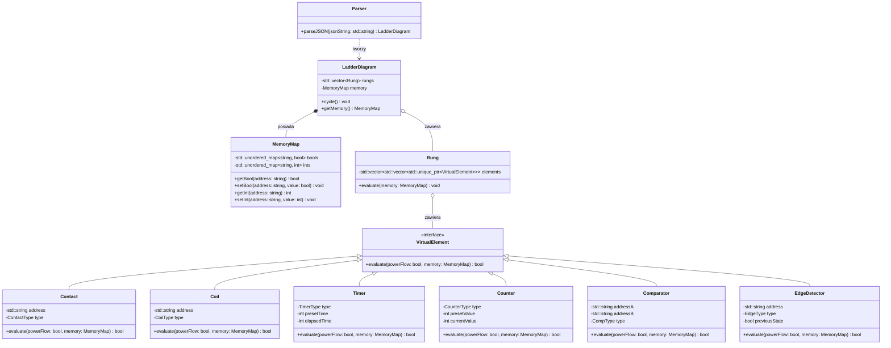

# Architektura Silnika PLC (LD-Lab)

Poniżej znajduje się schemat klas (UML) naszego symulatora:

```mermaid
classDiagram
    class VirtualElement {
        <<interface>>
        +evaluate(powerFlow: bool, memory: MemoryMap) bool
    }

    class MemoryMap {
        -std::unordered_map~string, bool~ bools
        -std::unordered_map~string, int~ ints
        +getBool(address: string) bool
        +setBool(address: string, value: bool) void
        +getInt(address: string) int
        +setInt(address: string, value: int) void
    }

    class Contact {
        -std::string address
        -ContactType type
        +evaluate(powerFlow: bool, memory: MemoryMap) bool
    }

    class Coil {
        -std::string address
        -CoilType type
        +evaluate(powerFlow: bool, memory: MemoryMap) bool
    }

    class Timer {
        -TimerType type
        -int presetTime
        -int elapsedTime
        +evaluate(powerFlow: bool, memory: MemoryMap) bool
    }

    class Counter {
        -CounterType type
        -int presetValue
        -int currentValue
        +evaluate(powerFlow: bool, memory: MemoryMap) bool
    }

    class Comparator {
        -std::string addressA
        -std::string addressB
        -CompType type
        +evaluate(powerFlow: bool, memory: MemoryMap) bool
    }

    class EdgeDetector {
        -std::string address
        -EdgeType type
        -bool previousState
        +evaluate(powerFlow: bool, memory: MemoryMap) bool
    }

    class Rung {
        -std::vector~std::vector~std::unique_ptr~VirtualElement~~~ elements
        +evaluate(memory: MemoryMap) void
    }

    class LadderDiagram {
        -std::vector~Rung~ rungs
        -MemoryMap memory
        +cycle() void
        +getMemory() MemoryMap
    }

    class Parser {
        +parseJSON(jsonString: std::string) LadderDiagram
    }

    %% Relacje dziedziczenia
    VirtualElement <|-- Contact
    VirtualElement <|-- Coil
    VirtualElement <|-- Timer
    VirtualElement <|-- Counter
    VirtualElement <|-- Comparator
    VirtualElement <|-- EdgeDetector

    %% Relacje kompozycji i agregacji
    Rung o-- VirtualElement : zawiera
    LadderDiagram o-- Rung : zawiera
    LadderDiagram *-- MemoryMap : posiada
    Parser ..> LadderDiagram : tworzy
```